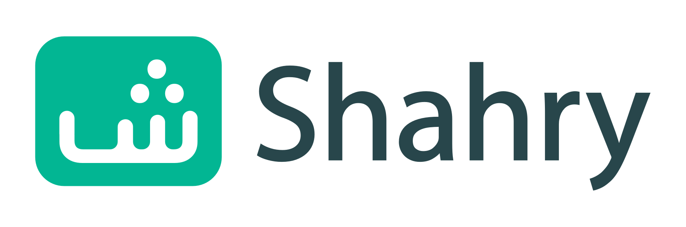
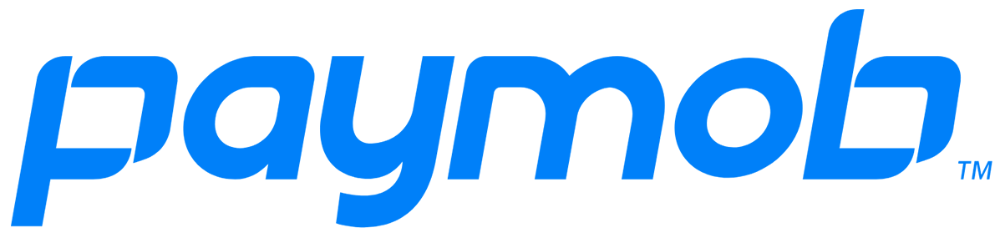
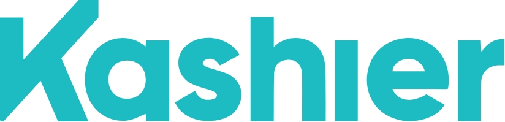

# Hi there 👋

<!--
**mohamedmansor/mohamedmansor** is a ✨ _special_ ✨ repository because its `README.md` (this file) appears on your GitHub profile.

Here are some ideas to get you started:

- 🔭 I’m currently working on ...
- 🌱 I’m currently learning ...
- 👯 I’m looking to collaborate on ...
- 🤔 I’m looking for help with ...
- 💬 Ask me about ...
- 📫 How to reach me: ...
- 😄 Pronouns: ...
- ⚡ Fun fact: ...
-->

### This is ***Mohamed Mansour*** , I'm a Software Engineer who loves building web apps and FinTech products

## 🔭 My professional experience domains

    * Building FinTech products
    * Payment integrations
    * E-learning websites
    * Securing Web Apps

## 🛠 My Toolkit

### 👨‍💻 **Languages that I feel interested in:**

    * Python
    * Django
    * Flask
    * Node JS
    * Express
    * Golang (still growing and learning)

### 💬 **Things that I can talk/write about and use:**  

    * System design
    * Scaling web apps
    * Performance Issues
    * Open API spacifications

### 🌱 **I’m currently learning:**

    * Designing Data-Intensive Applications

## 🏢 Companies I worked with

<table border=0 cellspacing=0 cellpadding=0 rules=none align="center"  overflow-y="hidden">

<td>
    
</td>
<td>
    
</td>
<td>
    
</td>
<td>
    
</td>

</table>

### 📫 How to reach me

<table border=0 cellspacing=0 cellpadding=0 rules=none align="center"  overflow-y="hidden">
<td>
    <a href="https://www.linkedin.com/in/mohamed-mansor" target="_blank">
    
</td>
<td>
    <a href="https://mohamedmansour.hashnode.dev" target="_blank">
    
</td>
<td>
    <a target="_blank" href="https://medium.com/@mohamedmansormemo"></img></a>
</td>
<td>
    &emsp;
    <a target="_blank" href="mailto:mohamedmansor212@gmail.com">
    </img></a>
    &emsp;
</td>
</table>
